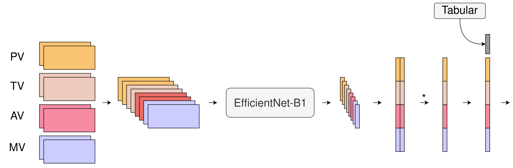

# Cinc22-Heartbeat

  Our entry to the 2022 George B. Moody Physionet Challenge.

by Jan Bremer & Marius Knorr

### Getting Started
1. Download the data: https://physionet.org/content/circor-heart-sound/1.0.3/
2. Set path to data in `main.py`

###

### Submissions
|     | Date             |           | Description              | CV                                 | mean    | LB                |
|-----|------------------|-----------|--------------------------|------------------------------------|---------|-------------------|
| 1   | 03.08.22         | submitted | cutmix 3 class           | 0.702, 0.799, 0.7826, 0.735, 0.775 | 0.758   | error             |
| 2   | 04.08.22         | submitted | same but 15 epochs not 9 | 0.732, 0.836, 0.752 , 0.829, 0.785 | 0.786   | error             |
| 3   | 04.08.22 - 00:10 | submitted | 16 epochs bs 4           | 0.742, 0.775, 0.762, 0.782, 0.775  | 0.767   | aborted           |
| 4   | 05.08.22         | -         | incl pregnant & sex      | 0.715, 0.806, 0.755, 0.765, 0.779  | 0.764   | -                 |
| 5   | 05.08.22 - 23:30 | submitted | 16 epochs bs 4           | 0.719, 0.769, 0.759, 0.698, 0.742  | 0.737   | 0.644             |
| 6   | 07.08.22 - 01:01 | submitted | pretrain                 | 0.779, 0.802, 0.719, 0.799, 0.789  | 0.777   | 0.696 / 10761.914 |
| 7   | 08.08.22 - 21:00 | submitted | 3x blend 16 epochs       | 0.827, 0.715, 0.725, 0.785, 0.801  | 0.77    | 0.696 / 12945     |
| 8   | 13.08.22 0:30    | submitted | tab features + auc cp    | 0.784, 0.682, 0.785, 0.712, 0.740  | 0.7406  | 0.651 / 9982.372  |
|     |                  |           |                          |                                    |         |                   |
    

### Docker
Remove all exited container:

        sudo docker ps -a | grep Exit | cut -d ' ' -f 1 | xargs sudo docker rm

Inspect and delete all imags not associated with a container:

        sudo docker image ls
        sudo docker image prune

Build image:

        docker build -t image .

Run container:

        sudo docker run --shm-size 8G -it --gpus all -v /home/mk/Documents/PhysionetChallenge2022/model:/physionet/model -v /home/mk/Documents/PhysionetChallenge2022/test_data:/physionet/test_data -v /home/mk/Documents/PhysionetChallenge2022/test_outputs:/physionet/test_outputs -v /home/mk/Documents/PhysionetChallenge2022/training_data:/physionet/training_data image bash
        docker run -it -v ~/example/model:/physionet/model -v ~/example/test_data:/physionet/test_data -v ~/example/test_outputs:/physionet/test_outputs -v ~/example/training_data:/physionet/training_data image bash
        sudo docker run -it -v /home/mk/Documents/PhysionetChallenge2022/model:/physionet/model -v /home/mk/Documents/PhysionetChallenge2022/test_data:/physionet/test_data -v /home/mk/Documents/PhysionetChallenge2022/test_outputs:/physionet/test_outputs -v /home/mk/Documents/PhysionetChallenge2022/training_data:/physionet/training_data image bash
        sudo docker run --shm-size 8G -it --gpus all -v /home/mk/Documents/PhysionetChallenge2022/cinc22-heartbeat/model:/physionet/model -v /home/mk/Documents/PhysionetChallenge2022/cinc22-heartbeat/test_data:/physionet/test_data -v /home/mk/Documents/PhysionetChallenge2022/cinc22-heartbeat/test_outputs:/physionet/test_outputs -v /home/mk/Documents/PhysionetChallenge2022/cinc22-heartbeat/training_data:/physionet/training_data image bash

Train / Inference / Evaluate:

        python train_model.py training_data model
        python run_model.py model test_data test_outputs
        python evaluate_model.py test_data test_outputs

### Abstract
#### This is not up-to-date. Please refer to the 4-pager.
The Physionet Challenge 2022 requires participants to detect the occurrence of murmurs in phonocardiograms. Here, we deployed a carefully validated deep learning approach to variable length audio classification.
Raw audio data at a 4,000 Hz sampling rate was converted to time-frequency images with 224 mel-frequency bands. Next, the images were subdivided into three non-overlapping crops along the time axis. The crops were augmented utilizing dropout augmentations as well as a mixup augmentation shuffling the order. During model training the crops were fed into an EfficientNet-B0 neural network returning feature embeddings for each crop. An average pooling layer unifies the feature embeddings of the three crops, followed by three output neurons (present, unknown, absent) with a softmax activation function for classification. The model was trained utilizing categorical cross entropy for 20 epochs and was employed in a stratified k-fold validation scheme with 6 folds (4 training, 1 validation, 1 threshold selection) and a hold-out test dataset (20%; 189 patients). The performance was monitored per epoch on the validation data. The best epoch was chosen based on the validation loss and subsequently used. The final probabilities were derived by averaging the probabilities of available phonocardiograms per patient. The threshold for each class is optimized by iterating over multiple thresholds on the threshold selection fold for the final predictions. Metrics were calculated on the hold-out test dataset for each fold. On the k-fold validation scheme we scored a competition metric of 509 (CI: 486 - 532), multi-class area under the receiver operating curve of 0.773 (CI: 0.755-0.791) and area under precision recall curve of 0.57 (CI: 0.55 - 0.59). A single fold of our approach yielded a competition score of 498 on the leaderboard with the team name uke-cardio.

